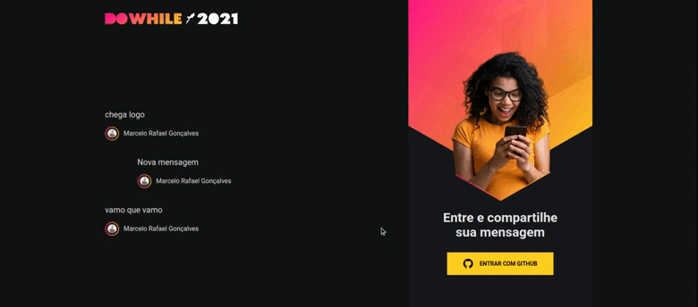

<div align="center">
  <!-- LICENSE -->
  
<!-- LAST COMMIT -->
<a href="https://github.com/marcelo-rafael/nlw_heat_web/commits/master">
    
  </a>
<!-- STARS -->
  <a href="https://github.com/marcelo-rafael/nlw_heat_web/stargazers/master">
    
  </a>
  <!-- FORKS -->
  <a href="https://github.com/marcelo-rafael/nlw_heat_web/forks/master">
    
  </a>
  <!-- AUTHOR -->
  
  <!-- LANGUAGES -->
   
  <!-- REPO SIZE -->
  
  <!-- CONTRIBUTORS -->
 
</div>

---

<h2 align="center">
 🚀 Next Level Week: Heat 🚀
</h2>

<p align="center"><a href="#">Deploy on Vercel</a></p>

---

#### 🚀 About

The entire interface of our system was developed, using React.js with TypeScript, Socket.io, Axios and Vite as project environment. It was amazing to develop this entire project, because I met Vite that is much faster than the famous create-react-app on Facebook.

---

<!-- #### 📋 Features

  - [x] Client list
  - [x] Add new client.
  - [x] Edit client.
  - [x] Delete client.

--- -->

#### 🎨 Layout

#### 💻  Web/Mobile

<h4 align="center">
  
</h4>  

---

#### ⚔️ Challenges

- [x] Create documentation
  - [x] demo gif
  - [x] Readme-me amazing
  - [x] Technologies used
  - [x] Project Setup
  - [x] Features
  - [ ] Add favicon
  - [ ] responsive layout

---

#### 🛠️ Tech Stack

The following tools were used in the construction of the project:

- **[React.js](https://pt-br.reactjs.org/)**
- **[TypeScript](https://www.typescriptlang.org/)**
- **[Vite](https://vitejs.dev/)**
- **[Sass](https://sass-lang.com/)**
- **[Axios](https://github.com/axios/axios)**
- **[React Icons](https://react-icons.github.io/react-icons/)**
- **[Socket.IO](https://socket.io/)**

---

## 🚀 How to run the project

### Prerequisites

Before starting, you will need to have the following tools installed on your machine:
[Git](https://git-scm.com), [Node.js](https://nodejs.org/en/).
Have an editor to work with the code like [VSCode](https://code.visualstudio.com/)

---

## 👯 Cloning the repository

```bash
# Clone this repository
$ git clone https://github.com/marcelo-rafael/nlw_heat_web

# Access the project folder in the terminal/cmd
$ cd nlw_heat_web

```

### Running the Application

```bash
# install dependencies
$ yarn or npm install

# Run Application in Development
$ yarn start or npm run start

# The application will open at port: 3000 - access http://localhost:3000
```

---

## 🔎 Commands

- `dev`: runs your application on `localhost:3000`
- `build`: creates the production build version
- `serve`: starts a simple server with the build production code

---

## 💪 How to contribute to the project

1. 🍴 Fork the project.
2. 👯 Clone this repository to your machine.
3. 🎋 Create a new branch with your changes: `git checkout -b my-feature`
4. ✅ Save the changes and create a commit message telling you what you've done: `git commit -m "feature: My new feature"`
5. 📌 Submit your changes: `git push origin my-feature`
6. 🔃 Create a new pull request

Once your pull request has been merged, you can delete `your-feature`

> If you have any questions, check out this [GitHub Contribution Guide](https://github.com/firstcontributions/first-contributions)

---

## 🤓 Autor


<div>
<a href="mailto:marcelo.rafael.goncalves@gmail.com">
      
   </a>
<a href="https://www.linkedin.com/in/marcelo-rafael-gonçalves/">
      
   </a>
<a href="https://github.com/marcelo-rafael">
  
  </a>
</div>

---

## 📝 LICENSE

This repository is licensed under the **MIT LICENSE**. For more detailed information, read the [LICENSE](./LICENSE) file contained in this repository.

<h3 align="center">
Made with ❤️ by <a href="https://www.linkedin.com/in/marcelo-rafael-goncalves/">Marcelo Rafael Gonçalves 💜🚀</a>
</h3>
